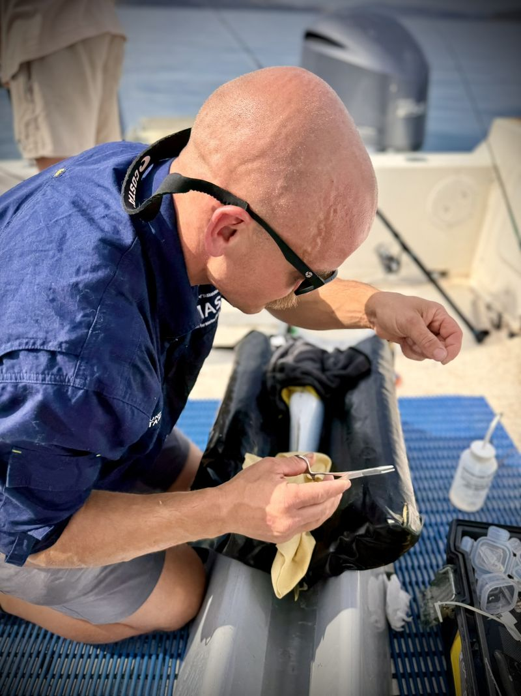
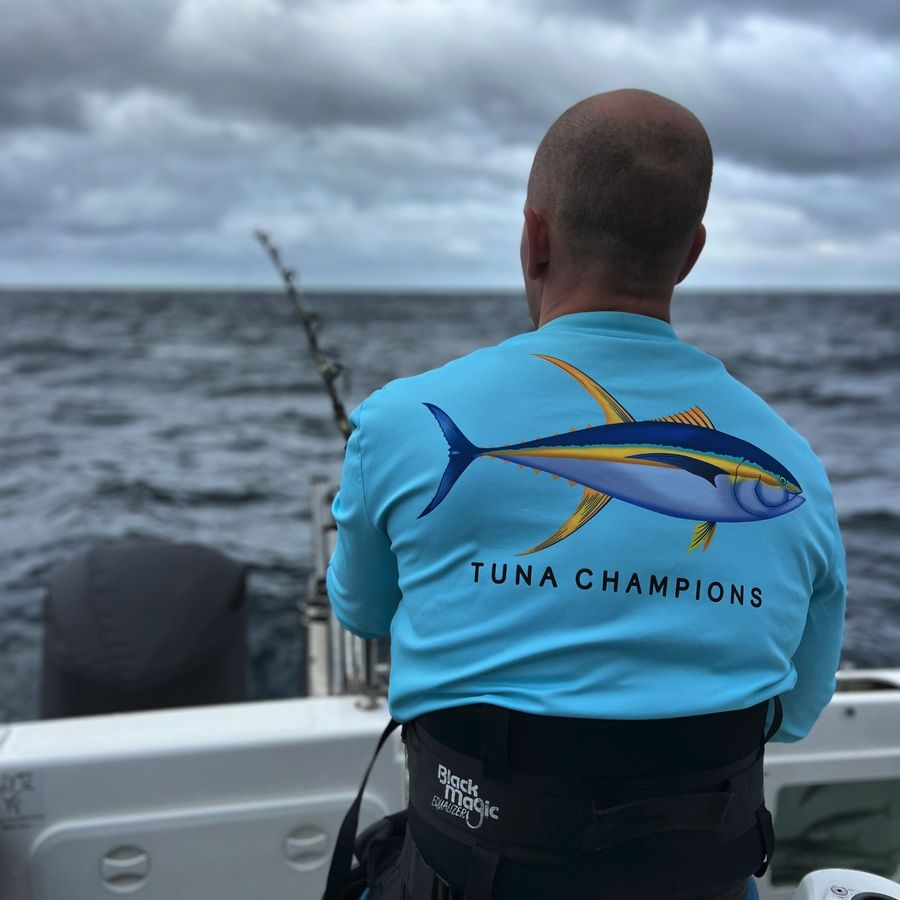

::: {.eyebrow .muted .first .page-top}
Institute for Marine and Antarctic Studies · University of Tasmania
:::

# Following fish through a changing ocean {.hero-title}

:::: {.project .intro .page-columns .page-full}
::: {.column-margin}
Dr Barrett Wolfe, Research Fellow and fisheries scientist at IMAS and national coordinator of [Redmap Australia](https://www.redmap.org.au). Based in nipaluna/Hobart, lutruwita/Tasmania.
:::

::: {.lede}
We study how coastal and pelagic fishes move and what limits where they can live as Australia's oceans warm. Much of the work is done with recreational fishers and citizen scientists, and is aimed at questions that fishery managers need answered.
:::
::::

::: {.hero-figure .column-page-right}
{fig-alt="Barrett Wolfe, right, and a deckhand bring a marlin alongside the boat for release" .hero-photo}

[Bringing a marlin alongside for release. Barrett is on the right.]{.credit}
:::

## What we work on

:::: {.project .theme .page-columns .page-full}
::: {.column-margin}
Tracey et al. 2023, *Scientific Reports*

Wolfe and Lowe 2015, *Marine Environmental Research*

{fig-alt="Barrett Wolfe implanting an acoustic tag in a fish on a padded cradle aboard a boat" .margin-photo}

[Implanting an acoustic tag before release.]{.credit}
:::

::: {.eyebrow}
Movement
:::

<h3>Where fish go, and when</h3>

Tags show where fish spend their time, which is the starting point for most spatial management. Our tracking has ranged from white croaker on a contaminated shelf off Los Angeles to swordfish moving between the temperate and tropical southwest Pacific.

```{=html}
<video class="loop-video body-video" autoplay muted loop playsinline preload="metadata" poster="images/lab/swordfish-dives.jpg" aria-label="Animated swordfish dive tracks over the seafloor off southeast Australia">
  <source src="images/lab/swordfish-dives.mp4" type="video/mp4">
</video>
```

[Swordfish dive tracks from pop-up satellite archival tags, drawn over the seafloor off southeast Australia (Tracey et al. 2023).]{.credit}
::::

:::: {.project .theme .page-columns .page-full}
::: {.column-margin}
Wolfe et al. 2020, *Conservation Physiology*

```{=html}
<video class="loop-video margin-video" autoplay muted loop playsinline preload="metadata" poster="images/lab/snapper-swim-tunnel.jpg" aria-label="A snapper swimming in a swim tunnel respirometer">
  <source src="images/lab/snapper-swim-tunnel.mp4" type="video/mp4">
</video>
```

[A tagged snapper in a swim tunnel, used to calibrate tag accelerations against metabolic rate.]{.credit}
:::

::: {.eyebrow}
Physiology
:::

<h3>What sets the limits</h3>

While the direction of range shifts broadly follows ocean warming, how far and how fast a species moves depends on its biology. We pair laboratory trials with field work to test which mechanisms matter, from snapper at their southern range edge to skates and sportfish after capture and release.
::::

:::: {.project .theme .page-columns .page-full}
::: {.column-margin}
Wolfe et al. 2025, *Diversity and Distributions*

[redmap.org.au](https://www.redmap.org.au)

```{=html}
<video class="loop-video margin-video" autoplay muted loop playsinline preload="metadata" poster="images/lab/sst-southeast-australia.jpg" aria-label="Animated monthly sea surface temperature off southeast Australia">
  <source src="images/lab/sst-southeast-australia.mp4" type="video/mp4">
</video>
```

[Monthly sea surface temperature off southeast Australia, one of the fastest-warming ocean regions.]{.credit}
:::

::: {.eyebrow}
Citizen science
:::

<h3>Species on the move</h3>

Redmap asks fishers, divers and beachgoers to log marine species they see outside their usual range. Combined with other citizen science and modelling, a decade of these records identified dozens of climate-driven range extensions around Australia.
::::

:::: {.project .theme .page-columns .page-full}
::: {.column-margin}
Recreational catches of tropical tunas and billfishes, FRDC 2022-173

{fig-alt="Barrett Wolfe, seen from behind in a Tuna Champions shirt, fishing from a game boat" .margin-photo}

[Out with the game fishing community.]{.credit}
:::

::: {.eyebrow}
Fishery data
:::

<h3>Getting more from the records we have</h3>

Many fisheries, recreational ones especially, lack the routine data that stock assessments rely on. We work on drawing reliable indicators from the records that do exist, such as club and charter logbooks, tournaments and tagging programs, and on which new monitoring is worth its cost.
::::

::: {.band .page-columns .page-full}

::: {.section-head .column-page-right}
<h2>Student projects</h2>

[All research and projects](research.qmd)
:::

::: {.card-grid .column-page-right}

::: {.project-card}
{fig-alt="Sand flathead (placeholder photo)"}

[PhD · from 2026]{.eyebrow}

[What makes a fish vulnerable?](research.qmd#vulnerable){.card-title}

[Stress physiology, behaviour and angling in an iconic species.]{.summary}

[Co-supervised]{.who}
:::

::: {.project-card}
{fig-alt="Skate, genus Bathyraja (placeholder photo)"}

[PhD · from 2022]{.eyebrow}

[Bycatch mortality of deep-sea skate](research.qmd#skate){.card-title}

[Movement and physiology of *Bathyraja irrasa* caught on demersal longlines.]{.summary}

[Co-supervised]{.who}
:::

::: {.project-card}
{fig-alt="Longface emperor, Palau (placeholder photo)"}

[PhD · completed 2026]{.eyebrow}

[Longface emperor fisheries in Palau](research.qmd#emperor){.card-title}

[Status of *Lethrinus olivaceus* to inform coral reef fisheries management.]{.summary}

[Christina Muller-Karanassos]{.who}
:::

::: {.project-card}
{fig-alt="Striped marlin (placeholder photo)"}

[Student project · 2025]{.eyebrow}

[Striped marlin species distribution models](research.qmd#marlin){.card-title}

[Linking striped marlin records to ocean conditions to map habitat through time.]{.summary}

[Jennifer Owen]{.who}
:::

::: {.project-card}
{fig-alt="Blue mackerel (placeholder photo)"}

[Student projects · 2023, 2024]{.eyebrow}

[Blue mackerel age and growth](research.qmd#mackerel){.card-title}

[Age and growth of one of the main species in Australia's Small Pelagic Fishery.]{.summary}

[Two students]{.who}
:::

::: {.summary-card}
[Supervision]{.eyebrow .muted}

[Three PhD students, one completed, and seven Honours and Masters students]{.big}

Unit coordinator for Fishing Technology and Science of Fishing at UTAS.

[Students and teaching](people.qmd)
:::

:::

:::

:::: {.project .page-columns .page-full #join}
::: {.column-margin}
Honours and Masters projects are also listed each year on the [IMAS study pages](https://www.utas.edu.au/imas/study/honours-and-masters-projects). For a PhD, get in touch well before the scholarship round closes.
:::

<h2>Study with me</h2>

I am keen to hear from prospective Honours, Masters and PhD students interested in fish movement and physiology, or in making better use of fishery data. Projects range from time on the water to modelling at a desk, and many involve working alongside recreational fishers.

[Email Barrett](mailto:barrett.wolfe@utas.edu.au){.button}
::::

[Student project photos are placeholders from iNaturalist under CC BY 4.0; see [image credits](credits.qmd).]{.credit .page-end-note}
