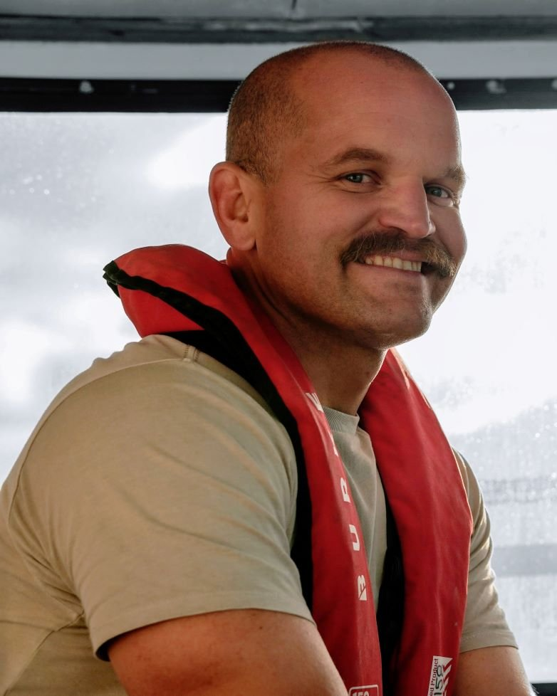
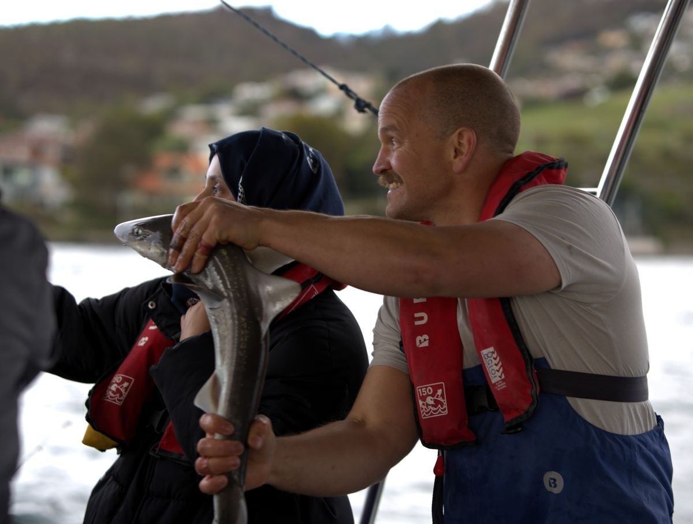
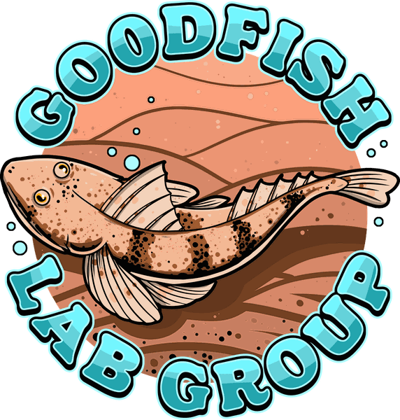
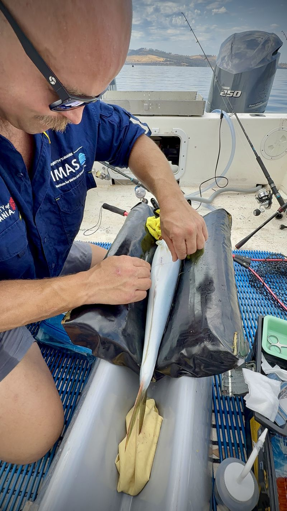

::: {.eyebrow .muted .first .page-top}
About
:::

# Barrett Wolfe {.page-title}

::: {.lede}
Based at IMAS in nipaluna/Hobart, I work closely with my students, with colleagues across the institute and with fisheries agencies around Australia.
:::

:::: {.project .page-columns .page-full #barrett}
::: {.column-margin}
{fig-alt="Barrett Wolfe in a red lifejacket in a boat cabin" .portrait-photo}

Email
: [barrett.wolfe@utas.edu.au](mailto:barrett.wolfe@utas.edu.au)

Profiles
: [Google Scholar](https://scholar.google.com/citations?user=5sLIXE4AAAAJ) · [ORCID](https://orcid.org/0000-0002-9406-0578) · [UTAS](https://discover.utas.edu.au/Barrett.Wolfe)
:::

::: {.eyebrow}
Research Fellow, Fisheries Scientist
:::

I am a fisheries scientist interested in how fish make a living in a changing ocean, and in how that knowledge can be put to use by fishers and managers. I studied marine biology at the University of Hawai[ʻ]{.okina}i at Mānoa (BSc 2009), then tracked fishes and sharks with the California State University Long Beach Shark Lab (MSc 2013). After a good deal of sailing around the Hawaiian Islands and work in fisheries ecology, I came to Tasmania for a PhD.

My PhD at IMAS (2021) looked at the physiological and behavioural mechanisms behind the range extension of snapper into southeast Tasmania. I am now a Research Fellow with the Sustainable Marine Research Collaboration at IMAS and national coordinator of Redmap Australia, and I supervise PhD, Masters and Honours students alongside coordinating undergraduate and postgraduate units.
::::

:::::: {.band .page-columns .page-full}

::::: {.project .page-columns .page-full #students}
::: {.column-margin}
[Supervision record]{.record-label}

[Three PhD students, one completed, and seven Honours and Masters students]{.record-big}

Projects span fish physiology, bycatch survival, reef fisheries assessment, species distribution modelling and fisheries biology.
:::

<h2 class="band-title">Students</h2>

::: {.list-head .first}
PhD, current
:::

::: {.student .no-thumb}
[PhD · from 2026]{.eyebrow}

[What makes a fish vulnerable? Linking stress physiology, behaviour and angling in an iconic species]{.name}

[Co-supervised]{.sup}
:::

::: {.student .no-thumb}
[PhD · from 2022]{.eyebrow}

[Integrating movement and physiological data to assess bycatch mortality of deep-sea skate *Bathyraja irrasa* in demersal longline fisheries]{.name}

[Co-supervised]{.sup}
:::

::: {.list-head}
PhD, completed
:::

::: {.student .no-thumb}
[PhD · 2022–2026]{.eyebrow}

[Christina Muller-Karanassos]{.name}

[Assessing the status of a commercially important emperor (*Lethrinus olivaceus*) to inform coral reef fisheries management in Palau]{.thesis}

[Co-supervised]{.sup}
:::

::: {.list-head}
Honours and Masters
:::

::: {.student .no-thumb}
[Masters · 2026]{.eyebrow}

[Junlin Chen]{.name}

[Method of meal delivery influences estimates of postprandial metabolism and alkaline tide in a benthic fish]{.thesis}

[Co-supervised with Harriet Goodrich, Goodfish Lab · [Chen et al. 2026, *Journal of Fish Biology*](https://doi.org/10.1111/jfb.70678)]{.sup}
:::

::: {.student .no-thumb}
[2025]{.eyebrow}

[Jennifer Owen]{.name}

[Striped marlin species distribution models]{.thesis}
:::

::: {.student .no-thumb}
[2023 and 2024]{.eyebrow}

[Blue mackerel age and growth]{.name}

[Two student projects]{.sup}
:::

[Seven Honours and Masters students in total.]{.list-note}
:::::

::::::

:::: {.project .page-columns .page-full #teaching}
::: {.column-margin}
Unit coordinator
: KSM312/601 Fishing Technology
: KSM002 Science of Fishing 1

Lectures
: KSM723 Marine predator diversity and ecology, and others

{fig-alt="Barrett Wolfe holding a small shark on a boat beside a student, with Hobart's hills behind" .margin-photo}

[On the water near Hobart.]{.credit}
:::

<h2>Teaching</h2>

I coordinate Fishing Technology and Science of Fishing at UTAS, and lecture across the Bachelor and Master of Marine and Antarctic Science on the ecology and physiology of predatory fishes and sharks, aquatic parasitology, and the analysis of biologging data.
::::

:::: {.project .page-columns .page-full #collaborators}
::: {.column-margin}
```{=html}
<a href="https://goodfishlab.com"></a>
```

[Goodfish Lab, IMAS · [goodfishlab.com](https://goodfishlab.com)]{.credit}
:::

<h2>Collaborators and partners</h2>

I work most closely with Harriet Goodrich's [Goodfish Lab](https://goodfishlab.com), a fish physiology group at IMAS, and more widely with colleagues across IMAS and the Centre for Marine Socioecology, with fisheries agencies including NSW DPIRD and Tasmania's Department of Natural Resources and Environment, and with fishing clubs and charter operators in Australia and New Zealand. My work has been funded by the Fisheries Research and Development Corporation, the Australian Government's National Environmental Science Program, the NSW Marine Estate Management Strategy, the Victorian Fisheries Authority, the Tasmanian Government's Fishwise program, TARFish, the Sea World Research and Rescue Foundation and the PADI Foundation.
::::

:::: {.project .page-columns .page-full #join}
::: {.column-margin}
Honours and Masters projects are also listed each year on the [IMAS study pages](https://www.utas.edu.au/imas/study/honours-and-masters-projects).

PhD scholarships: \[link to the current UTAS round and closing dates\]

{fig-alt="Barrett Wolfe tagging a fish on a padded cradle on a boat's deck" .margin-photo}
:::

<h2>Study with me</h2>

I am keen to hear from prospective Honours, Masters and PhD students interested in fish movement and physiology, or in making better use of fishery data. Projects range from time on the water to modelling at a desk, and many involve working alongside recreational fishers.

To get in touch, send a short note on what interests you and why, with your CV and academic transcript.

[Email me](mailto:barrett.wolfe@utas.edu.au){.button}
::::
