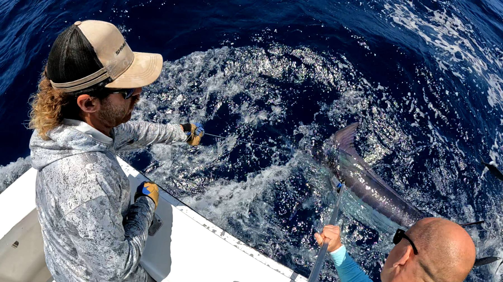
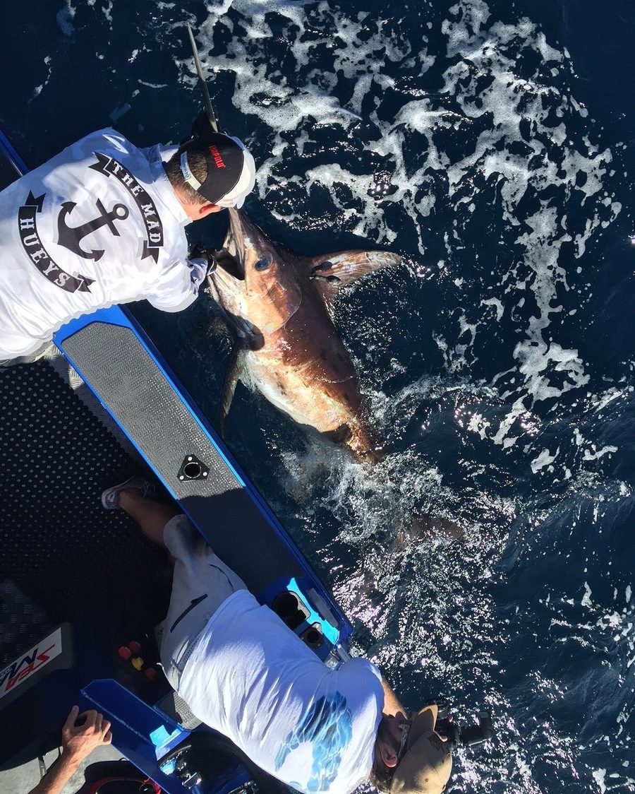
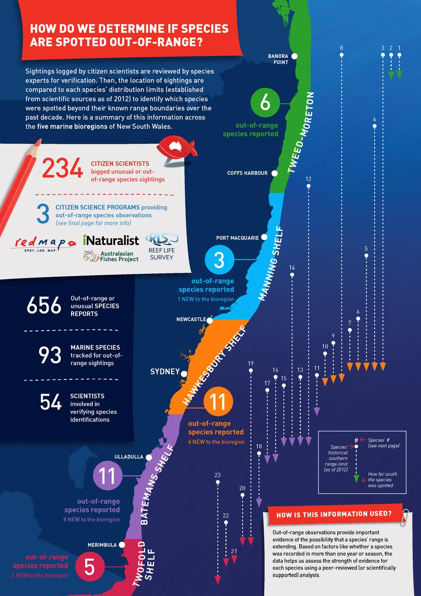
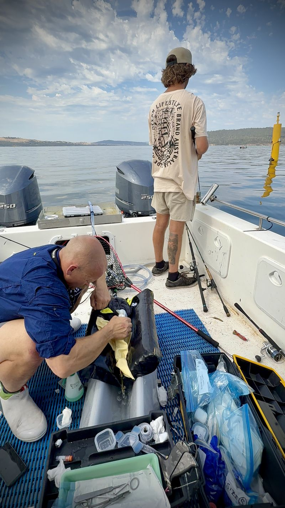
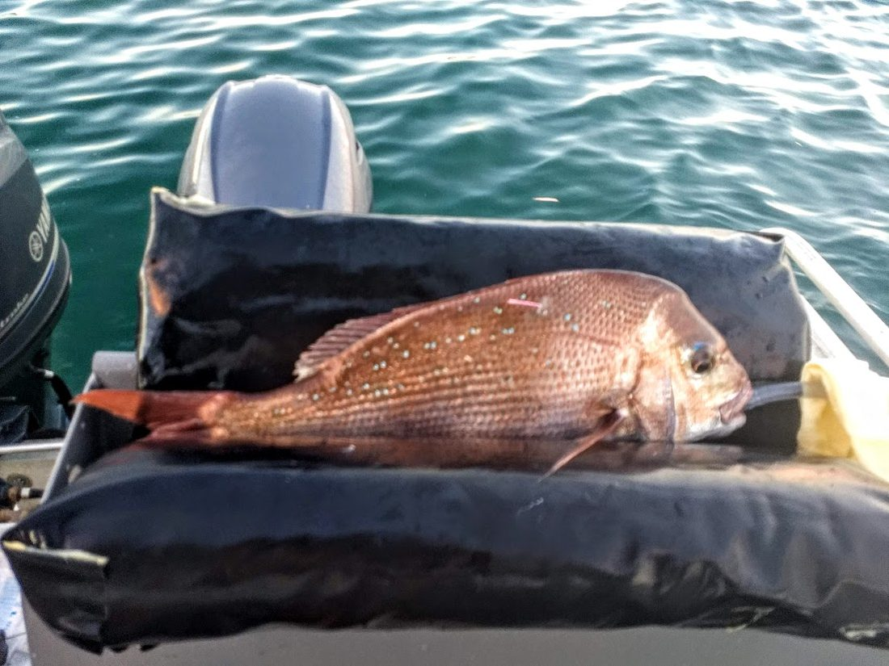

::: {.eyebrow .muted .first .page-top}
Research
:::

# Research and projects {.page-title}

:::: {.project .intro .page-columns .page-full}
::: {.column-margin}
Looking for a project? See [Study with me](people.qmd#join), or get in touch with an idea of your own.
:::

::: {.lede}
My projects range from national citizen science to studies of single species, and many are designed with the fishers and managers who will use the results. Student projects sit alongside the funded work, and often grow out of it.
:::
::::

:::::: {.band .page-columns .page-full}

## Student projects

:::: {.project .page-columns .page-full #vulnerable}
::: {.column-margin}
{fig-alt="Sand flathead (placeholder photo)"}

[Placeholder photo: Bee, CC BY 4.0, via iNaturalist](https://www.inaturalist.org/photos/607858193){.credit}

Degree
: PhD, from 2026

My role
: Co-supervisor

Thesis
: What makes a fish vulnerable? Linking stress physiology, behaviour and angling in an iconic species
:::

::: {.eyebrow}
PhD · from 2026
:::

<h3>What makes a fish vulnerable?</h3>

Some fish are more likely to be caught than others. This PhD links stress physiology and behaviour to angling in an iconic recreational species, to understand what makes individual fish vulnerable and what that means for how the fishery is managed.
::::

:::: {.project .page-columns .page-full #skate}
::: {.column-margin}
{fig-alt="Skate, genus Bathyraja (placeholder photo)"}

[Placeholder photo: Julien Savoie, CC BY 4.0, via iNaturalist](https://www.inaturalist.org/photos/643323709){.credit}

Degree
: PhD, from 2022

My role
: Co-supervisor

Thesis
: Integrating movement and physiological data to assess bycatch mortality of deep-sea skate *Bathyraja irrasa* in demersal longline fisheries
:::

::: {.eyebrow}
PhD · from 2022
:::

<h3>Bycatch mortality of deep-sea skate</h3>

Skates are a common bycatch in demersal longline fisheries. This PhD combines movement and physiological data to assess how many deep-sea skate (*Bathyraja irrasa*) survive capture, and what that means for fishery management.
::::

:::: {.project .page-columns .page-full #emperor}
::: {.column-margin}
{fig-alt="Longface emperor, Palau (placeholder photo)"}

[Placeholder photo: 陳德範 (Chen De-Fan), CC BY 4.0, via iNaturalist](https://www.inaturalist.org/photos/503639189){.credit}

Student
: Christina Muller-Karanassos, PhD 2022–2026

My role
: Co-supervisor
:::

::: {.eyebrow}
PhD · completed 2026
:::

<h3>Longface emperor fisheries in Palau</h3>

Christina assessed the status of the longface emperor (*Lethrinus olivaceus*), a commercially important reef fish, to inform coral reef fisheries management in Palau.
::::

:::: {.project .page-columns .page-full #meal}
::: {.column-margin}
Student
: Junlin Chen, Masters 2026

Supervision
: Harriet Goodrich (primary), [Goodfish Lab](https://goodfishlab.com); co-supervised by me

Output
: [Chen et al. 2026, *Journal of Fish Biology*](https://doi.org/10.1111/jfb.70678)
:::

::: {.eyebrow}
Masters · 2026
:::

<h3>Measuring the cost of a meal</h3>

After a fish eats, its metabolic rate rises for hours to days, and the size of that rise is a standard measure of the energetic cost of digestion. Junlin showed that the way a meal is delivered changes these estimates, along with the alkaline tide (the rise in blood bicarbonate that follows acid secretion in the stomach), in a benthic fish. This matters when comparing studies that fed their fish in different ways.
::::

:::: {.project .page-columns .page-full #marlin}
::: {.column-margin}
{fig-alt="Striped marlin (placeholder photo)"}

[Placeholder photo: Sula Vanderplank, CC BY 4.0, via iNaturalist](https://www.inaturalist.org/photos/310593379){.credit}

Student
: Jennifer Owen, 2025

Species
: Striped marlin, *Kajikia audax*
:::

::: {.eyebrow}
Student project · 2025
:::

<h3>Striped marlin species distribution models</h3>

Striped marlin are a prized recreational catch off eastern Australia and New Zealand, and their availability varies from year to year with ocean conditions. This project builds species distribution models linking striped marlin records to the environment, to map suitable habitat through the seasons and across years.
::::

:::: {.project .page-columns .page-full #mackerel}
::: {.column-margin}
{fig-alt="Blue mackerel (placeholder photo)"}

[Placeholder photo: Hugh Chan, CC BY 4.0, via iNaturalist](https://www.inaturalist.org/photos/633510499){.credit}

Students
: Two student projects, 2023 and 2024

Related
: Small Pelagic Fishery assessment reports (Ward et al. 2025)
:::

::: {.eyebrow}
Student projects · 2023, 2024
:::

<h3>Blue mackerel age and growth</h3>

Blue mackerel (*Scomber australasicus*) are one of the main species taken in Australia's Small Pelagic Fishery. Reliable estimates of age and growth show how productive the stock is and how it may respond to fishing.
::::

::::::

## Projects and collaborations

:::: {.project .page-columns .page-full #tunas-billfishes}
::: {.column-margin}
{fig-alt="Barrett Wolfe and a deckhand bringing a marlin alongside the boat for release" .margin-photo}

[Bringing a marlin alongside for release.]{.credit}

Funding
: Fisheries Research and Development Corporation, 2023–2025

Species
: Billfishes and tropical tunas, including striped marlin and yellowfin tuna

Output
: Final report \[link when published\]
:::

::: {.eyebrow}
Principal investigator · FRDC 2022-173
:::

<h3>Recreational catch data for tropical tunas and billfishes</h3>

Recreational catches of tunas and billfishes are recorded in club records, charter logbooks, tournaments, tagging programs and surveys, but rarely in a form that stock assessments can use directly. We standardised catch rates from each source, compared what each can detect, and set out a framework for monitoring from here.
::::

:::: {.project .page-columns .page-full #swordfish}
::: {.column-margin}
{fig-alt="Anglers holding a swordfish alongside the boat while a satellite tag is attached" .margin-photo}

[Tagging a swordfish alongside a recreational fishing boat.]{.credit}

```{=html}
<video class="loop-video margin-video" autoplay muted loop playsinline preload="metadata" poster="images/lab/swordfish-tracks.jpg" aria-label="Animated monthly positions of tagged swordfish">
  <source src="images/lab/swordfish-tracks.mp4" type="video/mp4">
</video>
```

[Monthly positions of the tagged swordfish.]{.credit}

With
: Sean Tracey and colleagues, IMAS

Outputs
: Tracey et al. 2023a, 2023b; Willis et al. 2026
:::

::: {.eyebrow}
Collaboration
:::

<h3>Swordfish movement and recreational fishing</h3>

Electronic tags on swordfish caught by recreational anglers in temperate Australian waters have shown how these fish move between the temperate and tropical southwest Pacific, how well they survive release, and how they use the thermocline during a fight.
::::

:::: {.project .page-columns .page-full #redmap}
::: {.column-margin}
{fig-alt="A page from the Redmap New South Wales report card showing out-of-range species along the coast" .margin-photo}

[A page from the Redmap New South Wales report card.]{.credit}

Website
: [redmap.org.au](https://www.redmap.org.au)

Output
: Wolfe et al. 2025, *Diversity and Distributions*
:::

::: {.eyebrow}
Ongoing
:::

<h3>Redmap Australia</h3>

Redmap invites fishers, divers and beachgoers to log marine species they see outside their usual range, and each record is checked by a scientist. I coordinate Redmap nationally, and use these records alongside other citizen science data to track climate-driven range extensions.
::::

:::: {.project .page-columns .page-full #flathead}
::: {.column-margin}
{fig-alt="Sand flathead (placeholder photo)"}

[Placeholder photo: Lawrence Hylton, CC BY 4.0, via iNaturalist](https://www.inaturalist.org/photos/570310878){.credit}

Funding
: FRDC 2020-005, led by Sean Tracey

Output
: Goodrich et al. 2026, *Conservation Physiology*
:::

::: {.eyebrow}
Collaboration
:::

<h3>Sand flathead in Tasmania</h3>

Sand flathead are among Tasmania's most popular recreational fish. I contributed to a cost-effective approach to monitoring and assessing the fishery, and to work showing how fish differ between heavily and lightly fished regions.
::::

:::: {.project .page-columns .page-full #crayfish-point}
::: {.column-margin}
{fig-alt="Barrett Wolfe implanting an acoustic tag on the deck while a student fishes from the stern" .margin-photo}

[Tagging fish on the water in southeast Tasmania.]{.credit}

Species of interest
: Bluethroat wrasse, sand flathead, southern rock lobster and juvenile snapper
:::

::: {.eyebrow}
In planning
:::

<h3>Crayfish Point acoustic array</h3>

A small array of acoustic receivers off Crayfish Point, Taroona, would give students hands-on tracking work close to Hobart, and support fine-scale studies of reef fishes and southern rock lobster, including inside the adjacent reserve.
::::

:::: {.project .page-columns .page-full #snapper}
::: {.column-margin}
{fig-alt="A snapper on a padded tagging cradle on a boat" .margin-photo}

[A snapper on the tagging cradle before release, southeast Tasmania.]{.credit}

Outputs
: Wolfe et al. 2020, *Conservation Physiology*; PhD thesis, University of Tasmania, 2021
:::

::: {.eyebrow}
PhD · 2021
:::

<h3>Snapper at their southern range edge</h3>

Snapper (*Chrysophrys auratus*) have become established in southeast Tasmania, south of their historical range. My PhD combined field work with laboratory trials to test how winter temperatures and behaviour shape where they can persist.
::::
